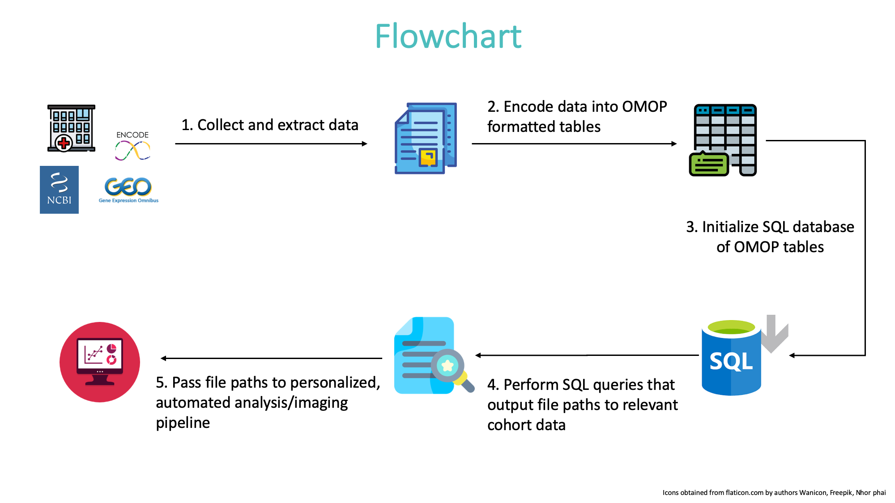

# OMOPOmics

## TLDR

OMOPOmics facilitates the transition of standardizing experimental datasets for reproducible research.

## Motivation 

Clinical and claims databases are adopting this data format promoted by Observational Health Data Science and Informatics (OHDSI). Patient data, agnostic of site, can be reproducibly extracted and analysed for generating population and patient-level evidence to improve medical practice. 

This framework can be extended to include patient diagnostic and biological data enabling precision medicine. 


However, experimental data has traditionally not been integrated under this infrastructure. But recently these approaches are more accessible, efficient, and feasible, creating an opportunity to integrate this information. Under the OMOP framework, data from biological experiments with different attributes such as disease states, time points, and perturbations can become more accessible and understood, as well as enable reproducibe analyses. 

OMOPOmics was created in January 2020 to show proof of concept and the importance for putting experimental data into the OMOP common data model. While this model has been primarily used for patient clinical data for insurance and claims purposes, we think this data infrastructure should be applied to biological experiments. 

We show from public datasets how we can store patient and sample data. Under the OMOP infrastructure, we produce reproducible queries of patient data for downstream use by custom bioinformatic analyses. 

## Workflow

We extended the [OMOP common data model](https://ohdsi.github.io/TheBookOfOhdsi/) for characterizing experimentally-derived patient data, with a specific application towards T-cell data to better treat auto-inflammatory diseases.


We have evaluated our infrastructure using example queries and analyses of patient ATAC-seq data sets from individuals with cutaneous T-cell lymphoma, healthy individuals with T-cell activation, or control patients (Qu et.al., 2015 [DOI](https://doi.org/10.1016/j.cels.2015.06.003.)). We manually downloaded and extracted data from GSE60682 in the GEO database. 

We show how to implement standardization of experimental data, to form a database, and to reproducibly query the data and run downstream analysis:



We give an example below. 

## Example Implementation

1. Download and install requirements

```
git clone https://github.com/NCBI-Codeathons/OMOPOmics.git
pip install -r requirements.txt
```
2. Create OMOP formatted tables from standardized experimental data format.
```
perl output_tables.pl GSE60682_details.tsv
```
The tables are written in a folder called `output/`.

3. Create SQL database from OMOP formatted tables: 

`ls OMOP_tables/*.csv | csv-to-sqlite -o OMOP_tables.sqlite -D`

4. Query database *Need command*
        
5. Execute downstream analysis *Need command*
