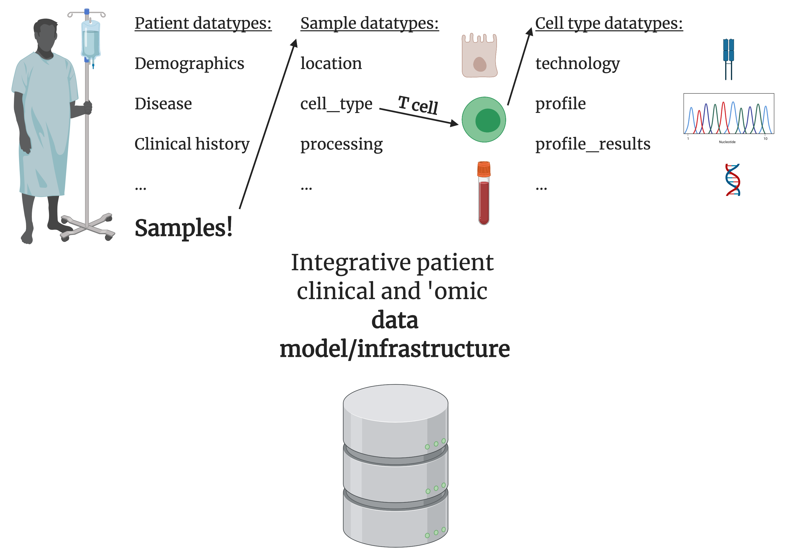
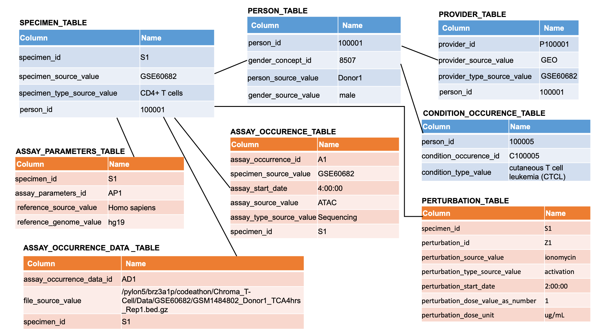

# OMOPOmics

DOWNLOAD REPOSITORY WITH `git clone https://github.com/NCBI-Codeathons/OMOPOmics.git`!!! Also install dependences with `pip install -r requirements.txt`

## Motivation 

OMOPOmics is inspired by the standardized infrastructure enabled by the OMOP common data model. 

Clinical and claims databases are adopting this data format promoted by Observational Health Data Science and Informatics (OHDSI). Patient data, agnostic of site, can be reproducibly extracted and analysed for generating population and patient-level evidence to improve medical practice. 

This framework can be extended to include patient diagnostic and biological data enabling precision medicine. However, experimental data has traditionally not been integrated under this infrastructure. But recently these approaches are more accessible, efficient, and feasible, creating an opportunity to integrate this information. Under the OMOP framework, data from biological experiments with different attributes such as disease states, time points, and perturbations can become more accessible and understood, as well as enable reproducibe analyses. 

OMOPOmics was created in January 2020 to show proof of concept and the importance for putting experimental data into the OMOP common data model. While this model has been primarily used for patient clinical data for insurance and claims purposes, we think this data infrastructure should be applied to biological experiments. 

We show from public datasets how we can store patient and sample data. Under the OMOP infrastructure, we produce reproducible queries of patient data for downstream use by custom bioinformatic analyses. 

## Workflow

We extended the [OMOP common data model](https://ohdsi.github.io/TheBookOfOhdsi/) for characterizing experimentally-derived patient data, with a specific application towards T-cell data to better treat auto-inflammatory diseases.

## Implementation

We have evaluated our infrastructure using example queries and analyses of patient ATAC-seq data sets from individuals with cutaneous T-cell lymphoma, healthy individuals with T-cell activation, or control patients (Qu et.al., 2015 [DOI](https://doi.org/10.1016/j.cels.2015.06.003.)).

We manually downloaded and extracted data from GSE60682 in the GEO database. 

We created a master data file with all the necessary data fields to create a minimally sufficient infrastructure in the OMOP CDM. 

From the master data file, run the perl script  like `run`. This creates a directory of the OMOP formatted tables.

We then run `ls OMOP_tables/*.csv | csv-to-sqlite -o OMOP_tables.sqlite -D`  in the command line to initialize a SQLite database from the directory with the OMOP formatted tables.

From the SQL database, we use example queries that output patient and sample cohort files for use in downstream ATACSeq analysis pipelines. 

# OMOPOmics framework step-by-step

1. Collect/Extract Data 
        Collect detailed information regarding patient demographic, NGS assay parameters, and treatment conditions

2. Enter Data into Relevant Tables

3. Initialize SQL database with `ls OMOP_tables/*.csv | csv-to-sqlite -o OMOP_tables.sqlite -D` command 

4. Load Perform directed search query for specific terms 
        e.g. **select** file_source_value **where** file_type_source_value == "BED" 
        **and** assay_source_value == ATAC **and** condition_source_value == "CTCL"

5. Export search results in .txt/.csv/.tsv
        
6. Use file paths/relevant parameters in automated analysis pipelines
            

